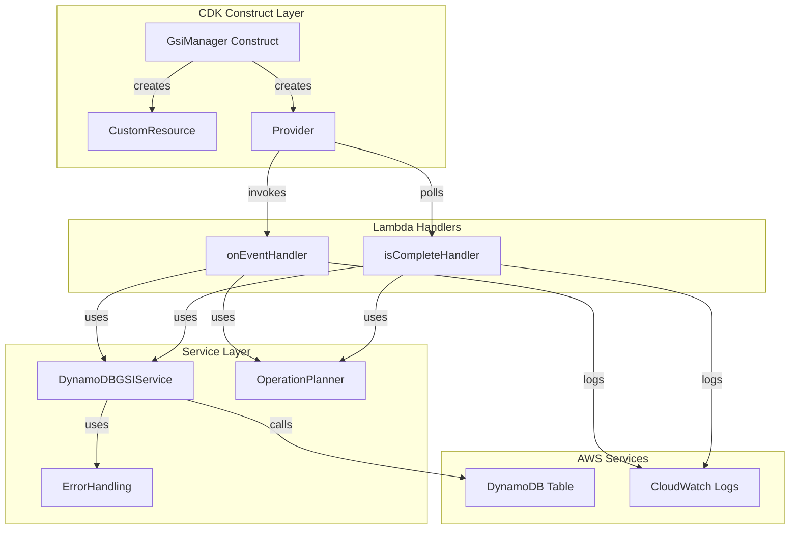
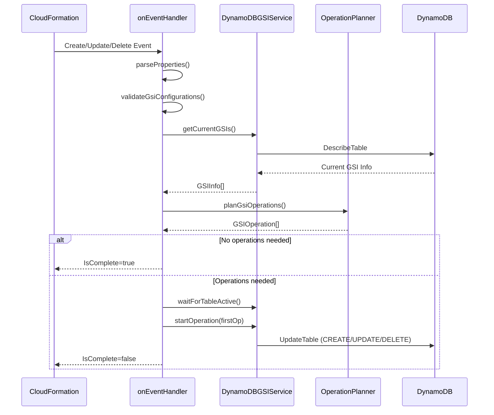
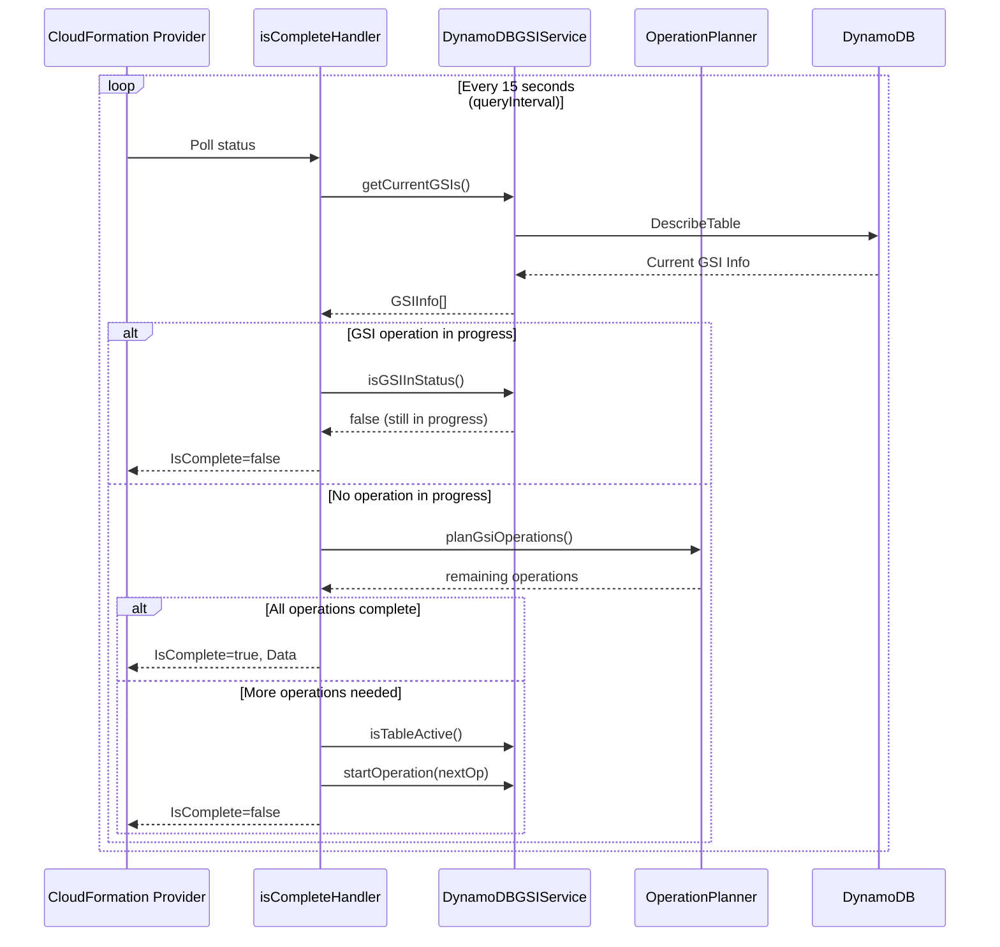
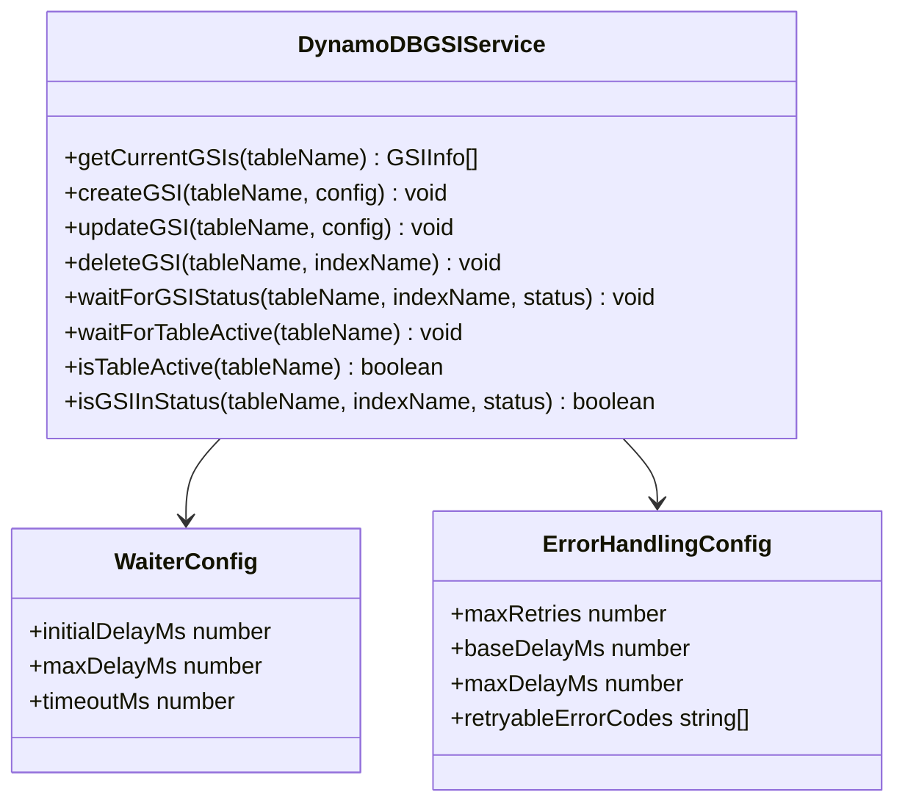
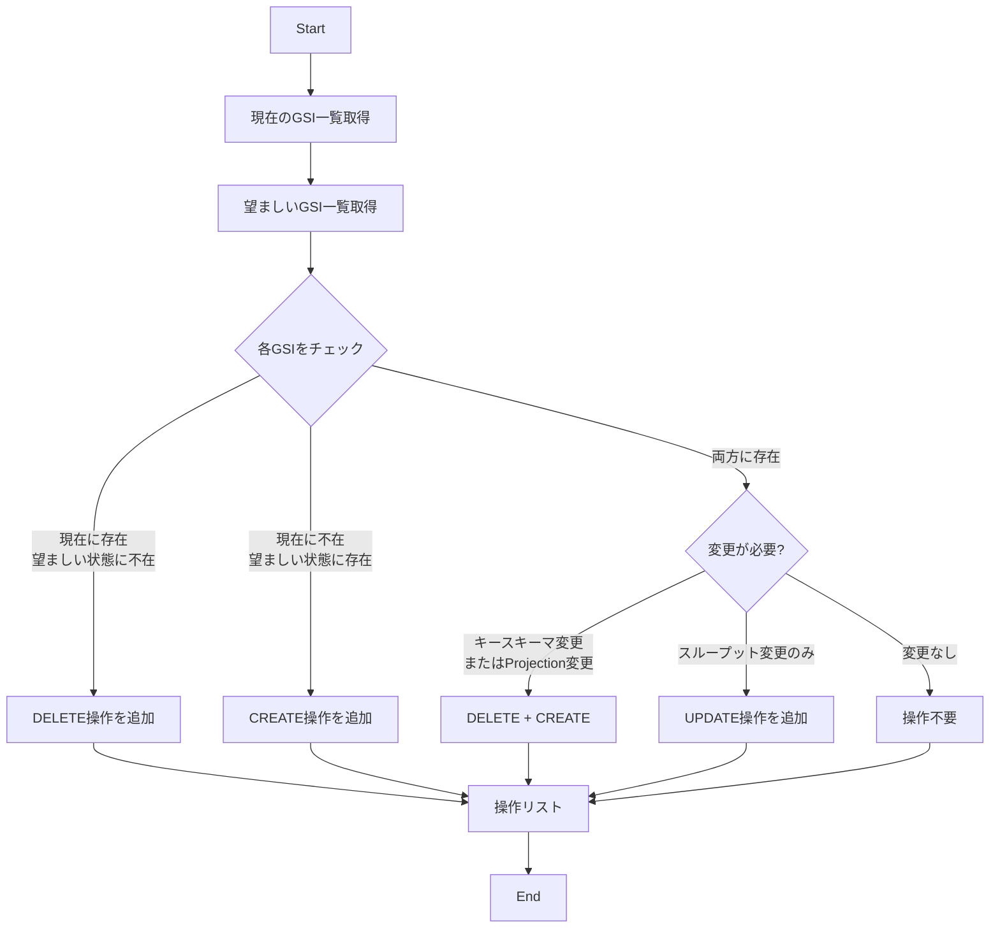
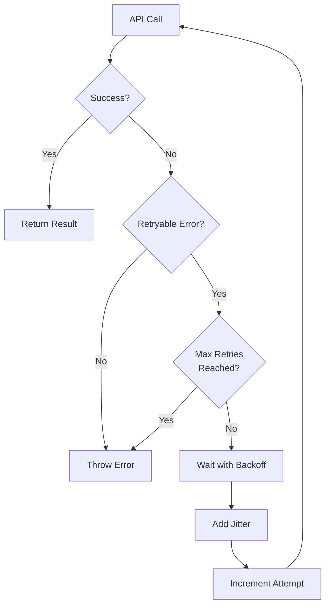
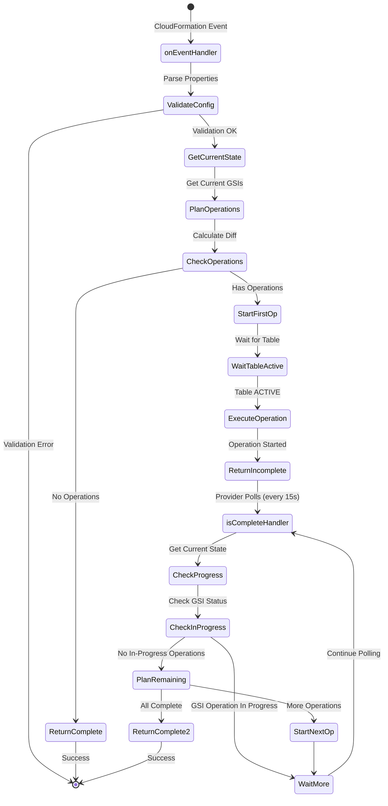
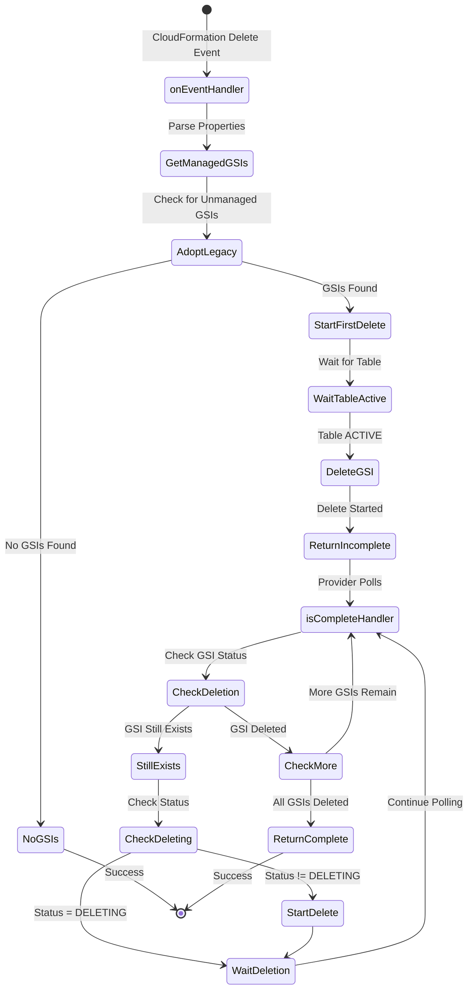
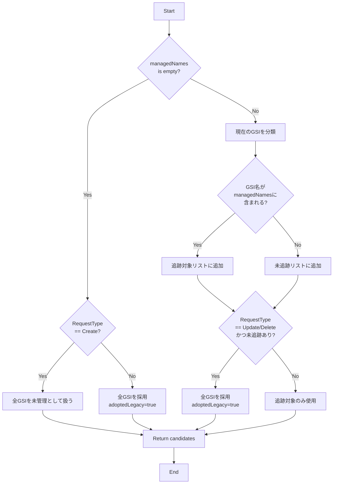
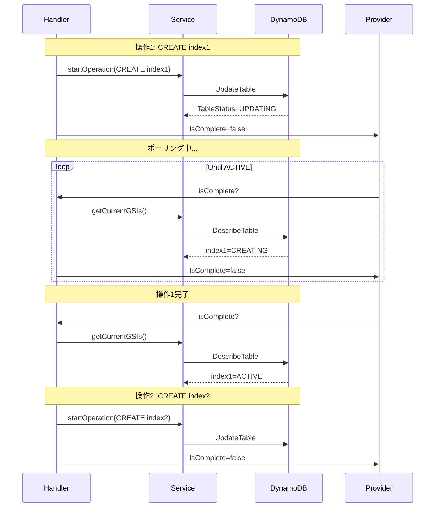

# GSI Manager - アーキテクチャと処理フロー

## 概要

GSI Manager は、DynamoDB のグローバルセカンダリインデックス（GSI）を CloudFormation カスタムリソースとして管理するシステムです。非同期カスタムリソースパターンを採用し、DynamoDB の制約（同時に1つのGSI操作のみ実行可能）に対応しながら、複数のGSI操作を順次実行します。

## システムアーキテクチャ



## コンポーネント構成

### 1. CDK Construct Layer

#### GsiManager (`lib/gsi-manager-construct.ts`)

CDK で GSI を管理するための高レベルな Construct です。

**主な責務:**
- Lambda 関数（onEventHandler と isCompleteHandler）の作成
- CloudFormation カスタムリソースプロバイダーの設定
- IAM 権限の付与

**設定パラメータ:**
- `table`: 管理対象の DynamoDB テーブル
- `globalSecondaryIndexes`: GSI の設定リスト
- `logRetention`: ログ保持期間（デフォルト: 1週間）
- `timeout`: Lambda タイムアウト（デフォルト: 15分）
- `errorHandling`: エラーハンドリング設定

### 2. Lambda Handlers

#### onEventHandler (`lambda/gsi-manager/src/handler.ts`)

CloudFormation のイベント（Create/Update/Delete）を受け取り、最初の GSI 操作を開始します。

**処理フロー:**



**重要な関数:**
- `handleCreateOrUpdateAsync()`: Create/Update イベントの処理
- `handleDeleteAsync()`: Delete イベントの処理
- `startOperation()`: GSI 操作を開始（待機なし）

#### isCompleteHandler (`lambda/gsi-manager/src/is-complete-handler.ts`)

操作の完了状態を確認し、次の操作を開始します。CloudFormation Provider によって定期的にポーリングされます。

**処理フロー:**



**重要な関数:**
- `checkOperationComplete()`: 操作の完了確認
- `startOperation()`: 次の操作を開始

### 3. Service Layer

#### DynamoDBGSIService (`lambda/gsi-manager/src/dynamodb-gsi-service.ts`)

DynamoDB との通信を抽象化するサービスレイヤーです。

**主な機能:**



**待機ロジック:**
- 初期待機時間: 3秒
- 最大待機時間: 20秒
- 指数バックオフで待機時間を増加
- タイムアウト: 15分（デフォルト）

**非同期パターン対応メソッド:**
- `isTableActive()`: テーブルがACTIVEか確認（待機なし）
- `isGSIInStatus()`: GSIが指定ステータスか確認（待機なし）

#### OperationPlanner (`lambda/gsi-manager/src/operation-planner.ts`)

現在のGSI状態と望ましい状態を比較し、必要な操作を計画します。

**操作計画のロジック:**



**検出される変更:**
- キースキーマの変更（パーティションキー、ソートキー）
- Projection の変更（ALL/KEYS_ONLY/INCLUDE、非キー属性）
- プロビジョニングスループットの変更

**重要な関数:**
- `keySchemaChanged()`: キースキーマの変更検出
- `projectionChanged()`: Projection の変更検出
- `shouldUpdateThroughput()`: スループット変更の検出

#### ErrorHandling (`lambda/gsi-manager/src/error-handling.ts`)

AWS SDK 呼び出しの再試行ロジックを提供します。

**再試行戦略:**



**再試行可能なエラー:**
- `ThrottlingException`
- `ProvisionedThroughputExceededException`
- `ResourceInUseException`

**デフォルト設定:**
- 最大再試行回数: 5回
- 基本待機時間: 1秒
- 最大待機時間: 30秒
- ジッター率: 20%

## 処理フロー詳細

### Create/Update フロー



### Delete フロー



### 管理対象 GSI の判定ロジック



## データ型とインターフェース

### GSI Configuration

```typescript
interface GSIConfiguration {
  indexName: string;
  partitionKey: AttributeDefinition;
  sortKey?: AttributeDefinition;
  projectionType?: "ALL" | "KEYS_ONLY" | "INCLUDE";
  nonKeyAttributes?: string[];
  provisionedThroughput?: ProvisionedThroughput;
}
```

### GSI Operation

```typescript
interface GSIOperation {
  type: "CREATE" | "UPDATE" | "DELETE";
  indexName: string;
  desiredConfiguration?: GSIConfiguration;
  currentConfiguration?: GSIInfo;
}
```

### GSI Info

```typescript
interface GSIInfo {
  indexName: string;
  keySchema: Array<{ attributeName: string; keyType: "HASH" | "RANGE" }>;
  projection: {
    projectionType: "ALL" | "KEYS_ONLY" | "INCLUDE";
    nonKeyAttributes?: string[];
  };
  indexStatus?: string;
  provisionedThroughput?: ProvisionedThroughput;
}
```

## DynamoDB 制約への対応

### 同時操作制限

DynamoDB は同時に1つのGSI操作のみを許可します。この制約に対応するため:

1. **onEventHandler**: 最初の操作のみを開始し、即座に返却
2. **isCompleteHandler**:
   - 進行中の操作がないことを確認
   - 次の操作を開始
   - 完了まで `IsComplete=false` を返却



### テーブルステータスの確認

各操作の前に `waitForTableActive()` を呼び出し、テーブルが ACTIVE 状態であることを確認します。

## エラーハンドリング戦略

### 1. 再試行可能エラー

指数バックオフで自動再試行:
- スロットリングエラー
- プロビジョニングスループット超過
- リソース使用中エラー

### 2. 再試行不可能エラー

即座に失敗:
- バリデーションエラー
- リソースが見つからない
- 権限エラー

### 3. タイムアウト

- Lambda タイムアウト: 15分（設定可能）
- Provider 全体タイムアウト: 2時間
- GSI/テーブル待機タイムアウト: 15分

## ログとモニタリング

### ログ出力

すべての重要なイベントをログ出力:

```typescript
console.log(`[GSI Manager][onEvent] Started operation ${type} for ${indexName}. Total operations: ${total}`);
console.log(`[GSI Manager][isComplete] Checking operations for table ${tableName}`);
console.log(`[GSI Manager][waitForGSIStatus] table=${tableName}, index=${indexName}, status=${status}`);
```

### 進捗報告

長時間実行の操作では、60秒ごとに進捗をログ出力:

```typescript
if (elapsed - lastProgressLog >= PROGRESS_LOG_INTERVAL_MS) {
  console.log(`[GSI Manager] Progress: ${completed}/${total} (${percent}%), elapsed ${elapsedSec}s`);
  lastProgressLog = elapsed;
}
```

## ベストプラクティス

### 1. べき等性

すべての操作はべき等です。同じ設定で複数回実行しても、同じ結果になります。

### 2. 段階的ロールアウト

大量のGSI変更は避け、少数のGSIを段階的に変更することを推奨します。

### 3. プロビジョニングスループット

PAY_PER_REQUEST モードを使用する場合、`provisionedThroughput` を指定しません。

### 4. 既存GSIの採用

既存のGSIは自動的に管理対象に採用されます（Update/Delete時）。

## トラブルシューティング

### タイムアウトエラー

**原因**: GSI作成に時間がかかる（特に大きなテーブル）

**解決策**:
1. `totalTimeout` を増やす（最大2時間）
2. Lambda の `timeout` を増やす
3. GSI 作成を分割する

### ResourceInUseException

**原因**: 前の操作が完了していない

**解決策**:
- 自動再試行で対応（エラーハンドリング設定）
- 待機時間が適切か確認

### ValidationException

**原因**: GSI 設定が無効

**解決策**:
1. キー属性がテーブルに存在するか確認
2. Projection 設定が正しいか確認
3. インデックス名が一意か確認

## 参考資料

- [AWS DynamoDB Developer Guide - Global Secondary Indexes](https://docs.aws.amazon.com/amazondynamodb/latest/developerguide/GSI.html)
- [AWS CloudFormation Custom Resources](https://docs.aws.amazon.com/AWSCloudFormation/latest/UserGuide/template-custom-resources.html)
- [AWS CDK Custom Resources](https://docs.aws.amazon.com/cdk/api/v2/docs/aws-cdk-lib.custom_resources-readme.html)
